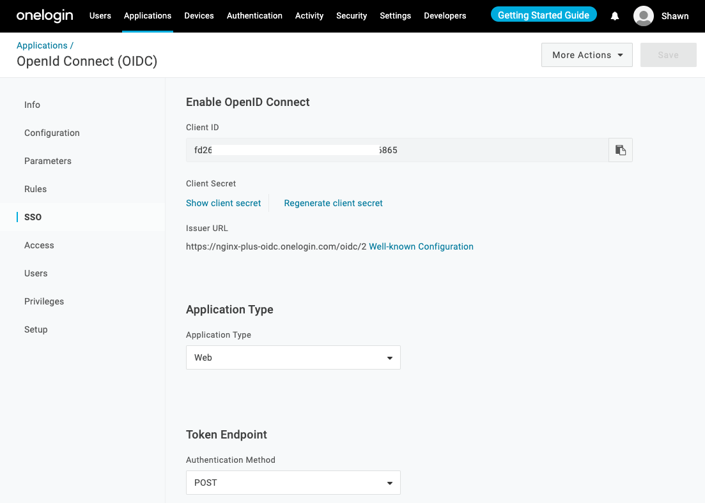
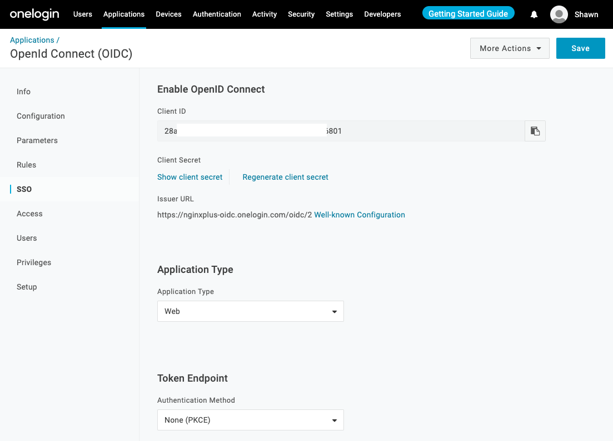

# How To Configure OneLogin for NGINX Plus OIDC Integration

Take the following steps to create a new application of OneLogin for integrating with NGINX Plus.

> **Note:**
>
> The following procedure reflects the OneLogin GUI at the time of publication, but the GUI is subject to change. Use this guide as a reference and adapt to the current OneLogin GUI as necessary.

- [Create a New Application](#create-a-new-application)
- [Create and Assign Users to App](#create-and-assign-users-to-app)

## Create a New Application

Create a new application for NGINX Plus in the OneLogin GUI:

1. Log in to your OneLogin account at `https://`**_domain_**`.onelogin.com`, where **_domain_** is the domain you chose when you created your account.

2. Click **`Applications`** in the title bar and then click the **`Add App`** button in the upper right corner of the window that opens.

   

3. On the **Find Applications** page that opens, type OpenID Connect in the search box. Click on the **OpenID Connect (OIDC)** row that appears.

   

4. On the **Add OpenId Connect (OIDC)** page that opens, change the value in the **Display Name** field to `nginxplus-oidc` and click the **`Save`** button.

   

5. When the save completes, a new set of choices appears in the left navigation bar. Click **Configuration**.

   - 5.1 Type **Redirect URI’s** :

     - Type the URI of the NGINX Plus instance including the port number, and ending in `/_codexch`.
     - Example: `https://nginx.onelogin.test:16000/_codexch`

   - 5.2 Type **Post Logout Redirect URIs** :

     - Type the URI of the NGINX Plus instance including the port number, and ending in `/_logout`.
     - Example: `https://nginx.onelogin.test:16000/_logout`

   - 5.3 Click the **`Save`** button.

   > **Notes:**
   >
   > For production, we strongly recommend that you use SSL/TLS (port 443).
   > The port number is mandatory even when you’re using the default port for HTTP (80) or HTTPS (443). But it it isn't needed if you use NGINX ACM.

   

6. When the save completes, click **SSO** in the left navigation bar.

   - Option 1. Take the following steps if you **don't enable PKCE**.

     - Copy and note **Client ID** and **Client secret**. You will add them to the NGINX Plus configuration in Step 3 of [Configuring NGINX Plus](https://github.com/nginx-openid-connect/nginx-oidc-onelogin/blob/main/docs/02-NGINX-Plus-Setup.md).
     - Choose **POST** in the combo box under **Token Endpoint** section.

     

   - Option 2. Take the following steps if you **enable PKCE**.

     - Copy and note **Client ID**. You will add them to the NGINX Plus configuration in Step 3 of [Configuring NGINX Plus](https://github.com/nginx-openid-connect/nginx-oidc-onelogin/blob/main/docs/02-NGINX-Plus-Setup.md).
     - Choose **None (PKCE)** in the combo box under **Token Endpoint** section.

     

## Create and Assign Users to App

1. Access the **Users** page under **`Users`** in the title bar, and click **`New User`** button.

   

2. Assign users to the application (in this guide, NGINX Plus) to enable them to access it for SSO. OneLogin recommends using [roles](https://onelogin.service-now.com/kb_view_customer.do?sysparm_article=KB0010606) for this purpose. You can access the **Roles** page under **`Users`** in the title bar.

   

   

   
